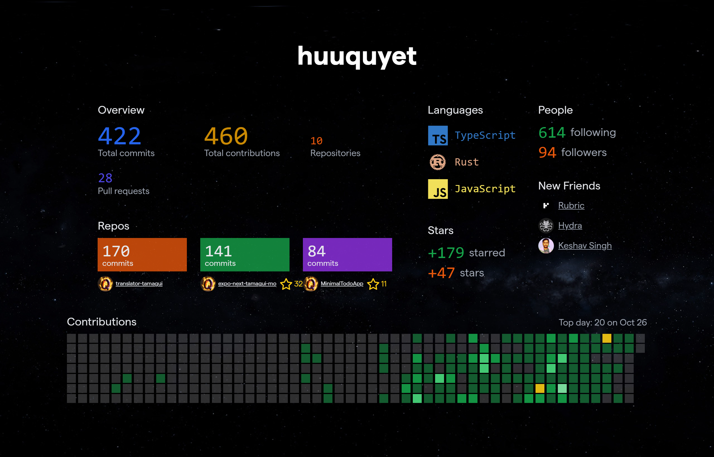

<div style="width:100%">
  
</div>

### Yesterday you said tomorrow, just do it

<div align="right">

[](https://github.com/huuquyet/huuquyet/actions/workflows/update-readme-profile.yml "Update profile automatically")
[](https://github.com/huuquyet/generate-awesome-text/actions/workflows/generate-on-issues.yml "Generate when new issue created")
[](.github/CODE_OF_CONDUCT.md "Contributor Covenant 2.1")
</div>

### Awesome wallpaper everyday

<details>
  <summary><b>🖼️ I created a Github action to generate this awesome wallpaper everyday</b></summary>

  <div align="center">

  
<!-- START_CAPTION -->

  *A labyrinthine maze of geometric patterns, each segment filled with a different abstract texture*
  by [CompVis/stable-diffusion-v1-4](https://hf.co/CompVis/stable-diffusion-v1-4)

<!-- END_CAPTION -->
  </div>
  <div align="right">

  *generated with [generate-awesome-wallpapers](https://github.com/huuquyet/generate-awesome-wallpapers)*
  </div>
</details>

### Funny answers from Gemini daily

**Want to chat with Gemini as a stand-up comedian?** Just click [this](https://github.com/huuquyet/huuquyet/issues/new?assignees=&labels=generate&projects=&title=Please+tell+me+how+to+be+funny+and+creative&body=Feel+free+to+change+the+title+then+Press+Submit%21)

<div align="center">

  
</div>
<div align="right">

  *generated with [generate-awesome-text](https://github.com/huuquyet/generate-awesome-text)*
</div>

### A random quote a day

This inspirational quote was also updated automatically ([source](https://github.com/lukePeavey/quotable))

<div align="center">
<!-- START_QUOTE -->
 
  > “Trust your hunches. They're usually based on facts filed away just below the conscious level.” 
  > 
  > *- Joyce Brothers -*

<!-- END_QUOTE -->
</div>

See this quote in [ASCII format](./cowsay_quotes.md)

---

### I love opensource ❤️

🌱 I’m currently learning Transfomers.js

💬 Ask me about


📫 How to reach me:
[](https://github.com/huuquyet "Github")
[](https://hf.co/huuquyet "Hugging Face")
[](https://x.com/huuquyetng "X.com")
[](https://fb.com/huuquyetng "Facebook")
[](mailto:huuquyetng@gmail.com "Gmail")
[](https://discord.com/users/772067447590879292 "Discord")
[](https://www.linkedin.com/in/huuquyet "LinkedIn")
[](https://buymeacoffee.com/huuquyet "Buy me a coffee")

😄 Pronouns: he/him

⚡ Fun fact: I'm lazy and useless

---

### Self-updated Github stats

<details open>
  <summary><b>🐍 Contribution grid snake animation</b></summary>

  <div align="center">
    <picture>
      <source srcset="./assets/github-contribution-grid-snake.svg" media="(prefers-color-scheme: light), (prefers-color-scheme: no-preference)">
      <source srcset="./assets/github-contribution-grid-snake-dark.svg" media="(prefers-color-scheme: dark)">
      
    </picture>
  </div>
  <div align="right">

  *generated with [Platane/snk](https://github.com/Platane/snk)*
  </div>
</details>

<details>
  <summary><b>🏆 Github Profile Trophies</b></summary>

  <div align="center">
    <picture>
      <source srcset="https://github-profile-trophy.vercel.app/?username=huuquyet&no-frame=true&theme=flat" media="(prefers-color-scheme: light), (prefers-color-scheme: no-preference)">
      <source srcset="https://github-profile-trophy.vercel.app/?username=huuquyet&no-frame=true&theme=onedark" media="(prefers-color-scheme: dark)">
      
    </picture>
  </div>
  <div align="right">

  *generated with [Github Profile Trophy](https://github.com/ryo-ma/github-profile-trophy)*
  </div>
</details>

<details>
  <summary><b>⚡ Github Profile Stats</b></summary>

  <div align="center">
    <picture>
      <source srcset="https://github-readme-stats.vercel.app/api/top-langs/?username=huuquyet&layout=donut&hide_border=true" media="(prefers-color-scheme: light), (prefers-color-scheme: no-preference)">
      <source srcset="https://github-readme-stats.vercel.app/api/top-langs/?username=huuquyet&layout=donut&hide_border=true&theme=onedark" media="(prefers-color-scheme: dark)">
      
    </picture>
    <picture>
      <source srcset="https://github-readme-stats.vercel.app/api?username=huuquyet&show_icons=true&hide_border=true" media="(prefers-color-scheme: light), (prefers-color-scheme: no-preference)">
      <source srcset="https://github-readme-stats.vercel.app/api?username=huuquyet&show_icons=true&hide_border=true&theme=onedark" media="(prefers-color-scheme: dark)">
      
    </picture>
  </div>
  <div align="right">
  
  *generated with [Github Readme Stats](https://github.com/anuraghazra/github-readme-stats)*
  </div>
</details>

<details>
  <summary><b>🔥 Github Profile Streak Stats</b></summary>

  <div align="center">
    <picture>
      <source srcset="https://streak-stats.demolab.com/?user=huuquyet&hide_border=true" media="(prefers-color-scheme: light), (prefers-color-scheme: no-preference)">
      <source srcset="https://streak-stats.demolab.com/?user=huuquyet&hide_border=true&theme=onedark" media="(prefers-color-scheme: dark)">
      
    </picture>
  </div>
  <div align="right">

  *generated with [GitHub Readme Streak Stats](https://github.com/DenverCoder1/github-readme-streak-stats)*
  </div>
</details>

<details>
  <summary><b>🕰️ Wakatime stats</b></summary>
  
<!--START_SECTION:waka-->
**I'm an Early 🐤** 

```text
🌞 Morning                595 commits         ████████░░░░░░░░░░░░░░░░░   31.20 % 
🌆 Daytime                776 commits         ██████████░░░░░░░░░░░░░░░   40.69 % 
🌃 Evening                400 commits         █████░░░░░░░░░░░░░░░░░░░░   20.98 % 
🌙 Night                  136 commits         ██░░░░░░░░░░░░░░░░░░░░░░░   07.13 % 
```
📅 **I'm Most Productive on Saturday** 

```text
Monday                   223 commits         ███░░░░░░░░░░░░░░░░░░░░░░   11.69 % 
Tuesday                  320 commits         ████░░░░░░░░░░░░░░░░░░░░░   16.78 % 
Wednesday                224 commits         ███░░░░░░░░░░░░░░░░░░░░░░   11.75 % 
Thursday                 257 commits         ███░░░░░░░░░░░░░░░░░░░░░░   13.48 % 
Friday                   254 commits         ███░░░░░░░░░░░░░░░░░░░░░░   13.32 % 
Saturday                 369 commits         █████░░░░░░░░░░░░░░░░░░░░   19.35 % 
Sunday                   260 commits         ███░░░░░░░░░░░░░░░░░░░░░░   13.63 % 
```


📊 **This Week I Spent My Time On** 

```text
💬 Programming Languages: 
Other                    14 hrs 50 mins      ██████████████░░░░░░░░░░░   55.26 % 
TypeScript               3 hrs 17 mins       ███░░░░░░░░░░░░░░░░░░░░░░   12.28 % 
Image (svg)              2 hrs 7 mins        ██░░░░░░░░░░░░░░░░░░░░░░░   07.90 % 
JSON                     1 hr 50 mins        ██░░░░░░░░░░░░░░░░░░░░░░░   06.88 % 
Markdown                 1 hr 46 mins        ██░░░░░░░░░░░░░░░░░░░░░░░   06.64 % 
```


 Last Updated on 30/05/2024 01:34:59 UTC
<!--END_SECTION:waka-->
  <div align="right">

  *generated with [Waka readme stats](anmol098/waka-readme-stats)*
  </div>
</details>

<details>
  <summary><b>✨ Year 2023 in code</b></summary>
  
  <div align="center">

  [](https://year-in-code.com/huuquyet "Year in code")
  </div>
  <div align="right">

  *generated with [Year in code](https://github.com/withgraphite/year-in-code)*
  </div>
</details>

---

Thanks for visiting my profile

<!--
**huuquyet/huuquyet** is a ✨ _special_ ✨ repository because its `README.md` (this file) appears on your GitHub profile.

Here are some ideas to get you started:

- 🔭 I’m currently working on ...
- 🌱 I’m currently learning ...
- 👯 I’m looking to collaborate on ...
- 🤔 I’m looking for help with ...
- 💬 Ask me about ...
- 📫 How to reach me: ...
- 😄 Pronouns: ...
- ⚡ Fun fact: ...
-->
